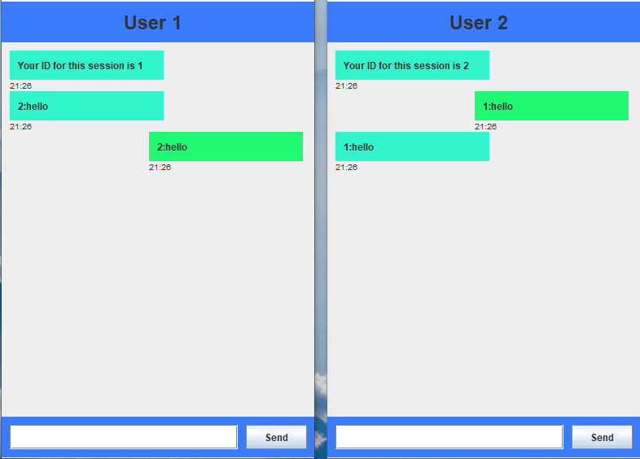

<h1>CHAT APPLICATION</h1>

This application is written in Java programming language using swing library for GUI.

The server can handle multiple users connected at the same time. Upon connecting the server gives an id to you, if you want to message a specific user who is online at the same time you must know his id.

Sending a messsage to an user who's id is familiar to you, simply at the begging of the message put his id followed by ':' and you message. 

 
Example:
 
Sending a message to an user with id 2 

Write the following: "2:Hello"

 
If you want to logout simply enter logout in the message box, and you may close the chat window.
 
 

Note:
This application is only basic. It's purpose is for simulating an active server that can handle clients, and it's a solid base for developing more advanced chat application

<h2>CHAT LOOK</h2>

  
   
   

